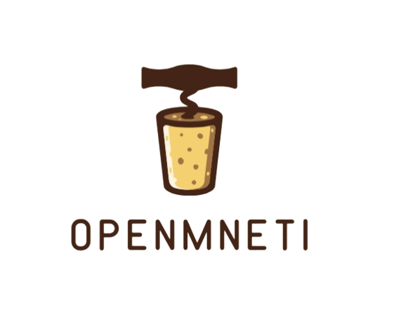

<a id="readme-top"></a>

[![Contributors][contributors-shield]][contributors-url]
[![Forks][forks-shield]][forks-url]
[![Stargazers][stars-shield]][stars-url]
[![Issues][issues-shield]][issues-url]
[![Apache 2.0][license-shield]][license-url]


<!-- PROJECT LOGO -->
<br />
<div align="center">
  <a href="https://github.com/Latte-X-sh/OpenMneti">
    
  </a>

  <h3 align="center">OpenMneti</h3>

  <p align="center">
    <i>Freedom is a pure idea. It occurs spontaneously and without instruction.</i>
    <br />
    OpenMneti is an open source wifi billing solution to empower the growing demand for internet use and control. Anyone can set it up and use. Turn your Home into an income generating stream. Or if you are an ISP, equip OpenMneti to your arsenal for effective internet management.
    <br />
    <a href="#"><strong>Explore the docs (comming soon) »</strong></a>
    <br />
    <a href="#">View Demo (coming soon)</a>
    &middot;
    <!-- <a href="https://github.com/othneildrew/Best-README-Template/issues/new?labels=bug&template=bug-report---.md">Report Bug</a>
    &middot;
    <a href="https://github.com/othneildrew/Best-README-Template/issues/new?labels=enhancement&template=feature-request---.md">Request Feature</a> -->
  </p>
</div>


<!-- TABLE OF CONTENTS -->
<details>
  <summary>Table of Contents</summary>
  <ol>
    <li>
      <a href="#about-the-project">About The Project</a>
      <ul>
        <li><a href="#built-with">Built With</a></li>
      </ul>
    </li>
    <li>
      <a href="#getting-started">Getting Started</a>
      <ul>
        <li><a href="#prerequisites">Prerequisites</a></li>
        <li><a href="#installation">Installation</a></li>
      </ul>
    </li>
    <li><a href="#usage">Usage</a></li>
    <li><a href="#roadmap">Roadmap</a></li>
    <li><a href="#contributing">Contributing</a></li>
    <li><a href="#license">License</a></li>
    <li><a href="#contact">Contact</a></li>
    <li><a href="#acknowledgments">Acknowledgments</a></li>
  </ol>
</details>


<!-- ABOUT THE PROJECT -->
## About The Project

<!-- [![Product Name Screen Shot][product-screenshot]](https://example.com) -->

OpenMneti is an open-source wifi billing solution that can be used by any ISP who would want to come up with a fully fledged solution. The implementation is to empower the emerging trend across Africa and the world to make it easy for any institution or firm to control their wifi mechanics. 

Here's why:
* You need a boiler plate to start for your wifi solution.
* The tech should be readily available for you.
* Focus on the business, let us handle the rest.

Offerings:
* Local standalone solution that you can self host.
    * Docker compose
    * Docker Swarm
    * Coolify - one-click (soon)
    * Dokploy - one-click (soon)

* Cloud solution.
    * Link your custom domain
    * Hosting done by us. We remove the headache for you!

<p align="right">(<a href="#readme-top">back to top</a>)</p>


### Built With

What a better way to stay afloat with django by having an actual django project. Built purely for learning bit commercially and technically to better understand scale and reach.

* [![Next][Next.js]][Next-url]
* [![Django][Django.com]][Django-url]

<p align="right">(<a href="#readme-top">back to top</a>)</p>


<!-- GETTING STARTED -->
## Getting Started

If you are a purist and you would love to run this software on your machine.
Here is a guide on how you can get started.

For users, who would want to get started, here is the link to the cloud version.

### Prerequisites

This is an example of how to list things you need to use the software and how to install them.


### Installation (Local Setup)

_Getting this setup installed locally._

1. Install docker: https://docs.docker.com/engine/install/ 
2. Navigate to the project location and run
   ```sh
   sudo docker compose up -d
   ```
3. Access the web on port 8080 (you can change using a .env file)
   ```sh
   http://localhost:8080
   ```

<p align="right">(<a href="#readme-top">back to top</a>)</p>


<!-- USAGE EXAMPLES -->
## Usage

OpenMneti can be used in different environments:

- Home networks
- Airbnb and hospitality setups
- Schools and campuses
- Local ISPs

_For more examples, please refer to the [Documentation](https://example.com)_

<p align="right">(<a href="#readme-top">back to top</a>)</p>


<!-- ROADMAP -->
## Roadmap
Initial Phase
- [ ] Django initial project
- [ ] Changelog
- [ ] Versioning
- [ ] Packaging
- [ ] Documentation(MkDocs)

Development phase
- [ ] FreeRadius to enable (AAA)
    - [ ] Accounting
    - [ ] Authorization
    - [ ] Authentication
- [ ] Payment integrations:
    - [ ] Modular based to suppor other Custom:
        - [ ] Cashfin
- [ ] Router integration
    - [ ] Mikrotik support
- [ ] Frontend (NextJs)
    - [ ] User authentication
    - [ ] Package purchase 
    - [ ] Internet access flow
    - [ ] Usage tracking
    - [ ] Subscription management
- [ ] Billing models
    - [ ] Pay-as-you-go
    - [ ] Wallet-based usage
    - [ ] Prepaid packages

Deployment
Local setup (single tenant use)
- [ ] Docker optimization
- [ ] CLI tooling
- [ ] One click installs
    - [ ] coolify

Cloud setup (multi-tenant use)
- [ ] Hosted platform
- [ ] Pricing tiers
- [ ] AI support

<!-- See the [open issues](https://github.com/othneildrew/Best-README-Template/issues) for a full list of proposed features (and known issues).

<p align="right">(<a href="#readme-top">back to top</a>)</p> -->


<!-- CONTRIBUTING -->
## Contributing

This project is built for the community.

If you extend it in production, we strongly encourage contributing improvements back so others can benefit.
Forking without contributing leads to fragmentation we are trying to solve.

Contributing steps:
1. Fork the Project
2. Create your Feature Branch (`git checkout -b feature/AmazingFeature`)
3. Commit your Changes (`git commit -m 'Add some AmazingFeature'`)
4. Push to the Branch (`git push origin feature/AmazingFeature`)
5. Open a Pull Request

Setup the dev environment:
* uv
    * Install uv from here: https://docs.astral.sh/uv/getting-started/installation/#installation-methods
    * Create virtual environment
        ```sh
        uv venv .venv
        ```
    * Install the project dependencies
        ```sh
        uv sync --dev --test --ci
        ```


<!-- ### Top contributors:

<a href="https://github.com/othneildrew/Best-README-Template/graphs/contributors">
  
</a>

<p align="right">(<a href="#readme-top">back to top</a>)</p> -->


<!-- LICENSE -->
## License

This project is licensed under the Apache License 2.0.
See `LICENSE.txt` for more information.

<p align="right">(<a href="#readme-top">back to top</a>)</p>

## Project Direction
The project will continue to evolve in this repository.

Once OpenMneti reaches version 1.0 (stable) and the cloud platform is available, it will be moved to a dedicated standalone repository.


<!-- CONTACT
## Contact

Project maintainers:
Your Name - [@your_twitter](https://twitter.com/your_username) 
Email 
- email@opmenti.com

<!-- Project Link: [https://github.com/your_username/repo_name](https://github.com/your_username/repo_name) -->

<p align="right">(<a href="#readme-top">back to top</a>)</p>


<!-- ACKNOWLEDGMENTS -->
## Acknowledgments

* Open source contributors
* Networking and ISP community
* [![Free Radius][freeradius.com]][free-radius-url]
* [![Cashfin][Cashfin.com]][Cashfin-url]

<p align="right">(<a href="#readme-top">back to top</a>)</p>


<!-- MARKDOWN LINKS & IMAGES -->
<!-- https://www.markdownguide.org/basic-syntax/#reference-style-links -->
[contributors-shield]: https://img.shields.io/badge/2-%2340453f?style=for-the-badge&label=contributors&labelColor=green
[contributors-url]: https://github.com/Latte-X-sh/OpenMneti/graphs/contributors

[forks-shield]: https://img.shields.io/badge/1-%233f4045?style=for-the-badge&label=FORKS&labelColor=blue
[forks-url]: https://github.com/Latte-X-sh/OpenMneti//network/members

[stars-shield]: https://img.shields.io/badge/0-%233f4045?style=for-the-badge&label=STARS&labelColor=blue
[stars-url]: https://github.com/Latte-X-sh/OpenMneti/stargazers

[issues-shield]: https://img.shields.io/badge/0-%233f4045?style=for-the-badge&label=ISSUES&labelColor=orange
[issues-url]: https://github.com/Latte-X-sh/OpenMneti/issues

[license-shield]: https://img.shields.io/badge/2.0-%2340453f?style=for-the-badge&label=Apache&labelColor=green
[license-url]: https://github.com/Latte-X-sh/OpenMneti/blob/master/LICENSE.txt

[product-screenshot]: images/screenshot.png

[Next.js]: https://img.shields.io/badge/next.js-000000?style=for-the-badge&logo=nextdotjs&logoColor=white
[Next-url]: https://nextjs.org/

[Django-url]: https://www.djangoproject.com/
[Django.com]: https://img.shields.io/badge/Django-%233f4045?style=for-the-badge&logo=django&labelColor=green
[Cashfin-url]: https://cashfin.africa
[Cashfin.com]: https://img.shields.io/badge/CASHFIN-%233f4045?style=for-the-badge&logo=cashfin&label=Cf&labelColor=orange

[free-radius-url]: https://www.freeradius.org/
[freeradius.com]: https://img.shields.io/badge/FreeRadius-%233f4045?style=for-the-badge&label=FR&labelColor=blue&cacheSeconds=orange